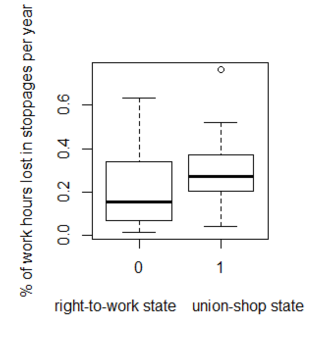
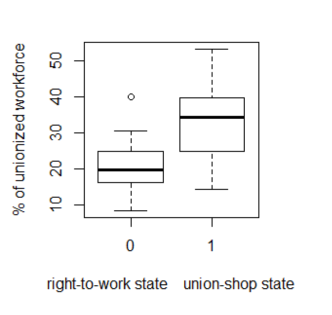
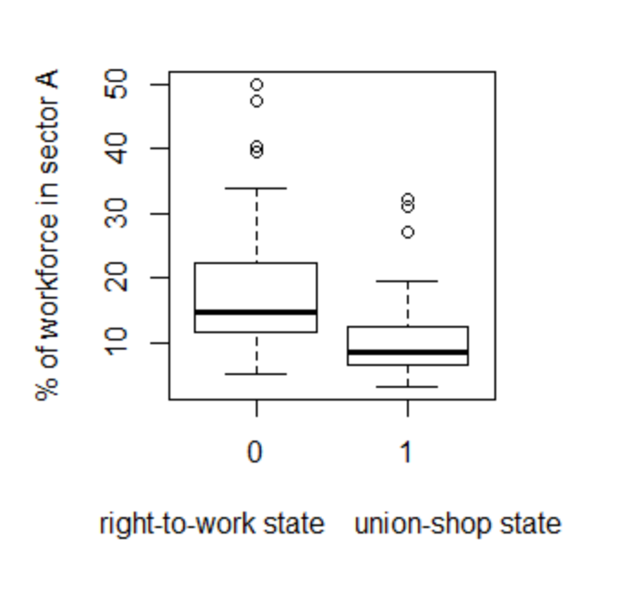
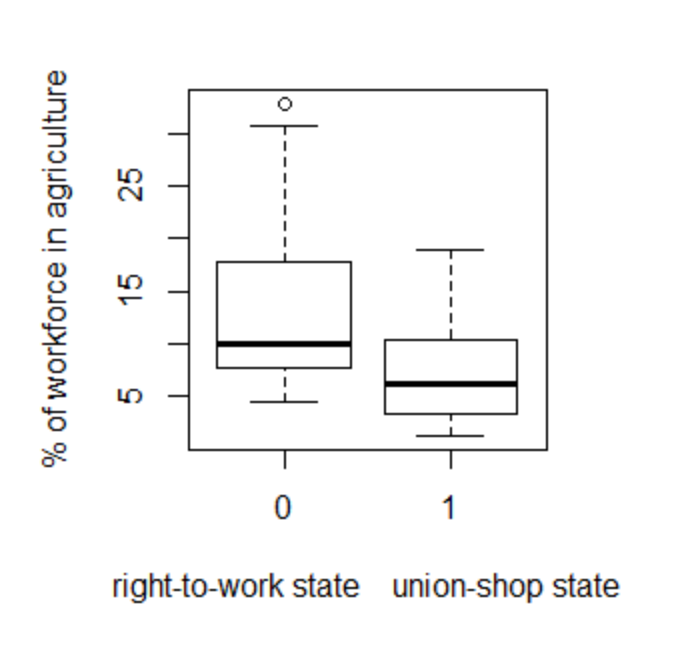

```{r setup, include=FALSE}
knitr::opts_chunk$set(echo = TRUE)
```

## R Markdown

This is an R Markdown document. Markdown is a simple formatting syntax for authoring HTML, PDF, and MS Word documents. For more details on using R Markdown see <http://rmarkdown.rstudio.com>.

When you click the **Knit** button a document will be generated that includes both content as well as the output of any embedded R code chunks within the document. You can embed an R code chunk like this:

```{r cars}
summary(cars)
```

## Including Plots

You can also embed plots, for example:

```{r pressure, echo=FALSE}
plot(pressure)
```

Note that the `echo = FALSE` parameter was added to the code chunk to prevent printing of the R code that generated the plot.

## Introduction

In US labor policies, an union security agreement is an agreement between an employer and a labor union. They agree to what extent employees have to join the labor union and/or if the employers will collect fees for this participation [1].

The rationale behind union security agreement is that forming the union and negotiating with the employer may cost a lot of money, and the benefit from this can also come to the non-union member [2].

In that case, the employees may not want to be part of the union, and it won’t have enough money to negociate efficiently and will eventually collapse. In that case, situation for all employees will be worse. Union security agreement are a way to ensure that all employee pay their fair share. [2]

In some cases, employees may be forced to join labor unions as a condition for hiring, and to pay for representation [3]
Right-to-work laws prohibit such union security agreements [4]. It is adopted in some states, called « Right-to-work states », and not in others, called « union-shop states ».

A major claim to justify the usefulness of right-to-work law is that work hours lost in stoppages in some states were lessened thanks to the law. [5]

The purpose of this study is to assess whether this statement is true, and if there is any correlation between right-to-work laws and industrial conflict.


## First analysis

A first step in our study is to compare work hours lost in stoppages in right-to-work states and union shop-states. We can observe the difference of distribution on the following plot.
 


The causes for this observed difference may be something else than existence or non-existence of a right-to-work law. Therefore we will use factors that vary between the two categories of states, and conduct a multiple linear regression.

## The parameters

We consider other variables that differ between right-to-work state and union-shop states, to see if there is a causative effect on the level of industrial conflict.

# Unionization degree, count in percent of unionized workforce.
 


Unionization degree vary a lot between the two type of states.
Indeed, it is logical to think that unionization is higher in forced-union state.
And unionization might have a correlation for more industrial conflict.

# union-shop dummy

Which indicates whether a state is right-to-work or union-shop. By including it in the regression, we can assess its importance.

# Non-unionized industry
Sector A regroup relatively non-unionized industry, such as food, textile and apparel.
 


Right-to-work states seem to have more « Sector A » workers.
Dispersion of union strength could causes less stoppages

# Relative size of the agricultural labor force.
 


According to the plot, agriculture seems more present in the right-to-work state and might be a factor for less stoppages, because it is a relatively non-unionized industry.

## The regression

After doing our regression, we find such coefficient :
 
          (Intercept)     Data$Union_degree 
          0.043266306           0.009983541 
           Data$dummy Data$Sector_A_workers 
         -0.057585306          -0.002085292 
       Data$Ag_forces 
          0.001141738 
          
And such p-values associated with the coefficient : 

                     		 	t value 		Pr(>|t|)    
(Intercept)            		  0.479 		0.634692    
Data$Union_degree      	   3.809 		0.000438 ***
Data$dummy             	 	-1.058 		0.295837    
Data$Sector_A_workers 	   -0.776 	 0.442250    
Data$Ag_forces        		   0.265 	 0.792003 

We observe that only unionization has sufficiently small p values to reject the null hypothesis that unionization and industrial conflict have no correlation to 0.001 significance level.
More importantly, this statistical study does not let us conclude that there is any correlation between right-to-work law and industrial conflict.

## References

[1] Pynes, Joan. Human Resources Management for Public and Nonprofit Organizations. 2d ed. Hoboken, N.J.: John Wiley and Sons, 2004. ISBN 0-7879-7078-6

[2] Towers, Brian. The Representation Gap: Change and Reform in the British and American Workplace. Oxford, England: Oxford University Press, 1997. ISBN 0-19-829319-4; Holley, William H.; Jennings, Kenneth M.; and Wolters, Roger S. The Labor Relations Process. 9th ed. Florence, Ky.: Cengage Learning, 2008. ISBN 0-324-42144-3; Beatty, David M. Putting the Charter to Work: Designing a Constitutional Labour Code. Toronto: McGill-Queen's Press - MQUP, 1987. ISBN 0-7735-0601-2; Bar-Niv, Zvi H. International Labour Law Reports, Volume 8. Leiden, The Netherlands: Martinus Nijhoff Publishers, 1990. ISBN 0-7923-0429-2

[3] Baird, Charles W. "Right to work before and after 14 (b)." Journal of Labor Research 19.3 (1998): 471-493.

[4] "Employer/Union Rights and Obligations". National Labor Relations Board. Retrieved July 7, 2017.

[5] Right to Work National Newsletter, Vol. 10, No. 1 (Jan. 27, 1964), p. 4 and Chamber of Commerce of the United States, Exposed: Union Myths A bout Right-to-Work Laws, 1964, p. 14. 5U.S. Bureau of Labor
